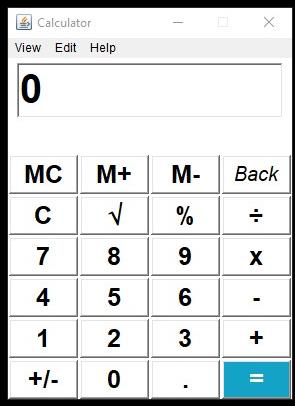
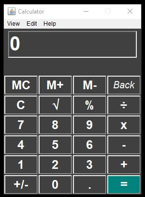
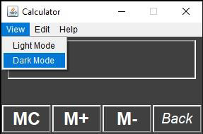
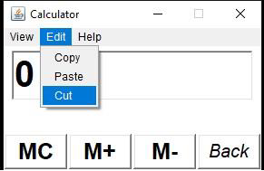
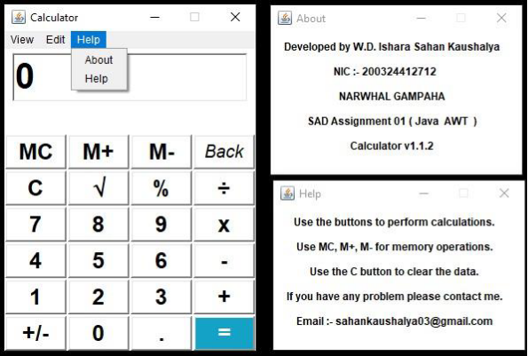
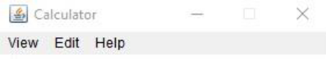

**Java AWT Calculator** 

**Overview** 

This documentation provides an overview of the Calculator application developed using  Java  AWT  components  and  event  handling.  The  calculator  offers  basic arithmetic  operations,  percentage  calculation,  square  root  computation,  memory functions, and additional features like mode switching, and text operations (copy, paste, cut). It also includes help and about sections. 

**Graphical User Interface (GUI)** 

 

Light Mode  Dark Mode 

**Menu Bar Items** 

 

View  Edit 

Help 

**Features** 

Basic Arithmetic Operations 

- Addition (+): Adds two numbers. 
- Subtraction (-): Subtracts the second number from the first number. 
- Multiplication (x): Multiplies two numbers. 
- Division (÷): Divides the first number by the second number.

Additional Operations 

- Percentage (%): Calculates the percentage of a number. 
- Square Root (√): Calculates the square root of a number. 
- Change Sign (+/-): Changes the sign of the number displayed. 
- Clear (C): Clears the current input.

Memory Operations 

- Memory Clear (MC): Clears the memory. 
- Memory Add (M+): Adds the current input to the memory. 
- Memory Subtract (M-): Subtracts the current input from the memory.

User Interface Options 

- Light Mode: Switches the calculator to a light colour scheme. 
- Dark Mode: Switches the calculator to a dark colour scheme. 
- Copy: Copies the current input to the clipboard. 
- Paste: Pastes the content from the clipboard to the input field. 
- Cut: Cuts the current input and copies it to the clipboard. 
- Backspace (Back): Deletes the last character in the input field.

Help and About 

- About: Provides information about the developer and the application. 
- Help: Provides instructions on how to use the calculator.

**Technologies Used** 

Java AWT 

- The  application  is  built  using  the  Abstract  Window  Toolkit  (AWT),  which provides a set of APIs for creating graphical user interfaces in Java. 

**Event Handling** 

- Event  handling  in  the  application  is  implemented  using  ActionListener  to manage user interactions with buttons and menu items. 

**Clipboard Operations** 

- Clipboard  operations  (copy,  paste,  cut)  are  handled  using  the **java.awt.datatransfer** package**.** 

**Frame and Panel** 

The user interface is constructed using Frames and Panels: 

- Frame: The main window and additional windows for "About" and "Help". 
- Panel: Used for organizing the layout of buttons and the text field. 

**Buttons** 

The calculator has the following buttons for user interaction: 

- Numeric buttons: 0-9 
- Arithmetic operation buttons: +, -, x, ÷ 
- Additional operation buttons: %, √, +/-, C, Back, . 
- Memory operation buttons: MC, M+, M- 
- Equals button: = 

Additional Operations 

- Percentage (%): Calculates the percentage of a number. 
- Square Root (√): Calculates the square root of a number. 
- Change Sign (+/-): Changes the sign of the number displayed. 
- Clear (C): Clears the current input.

Memory Operations 

- Memory Clear (MC): Clears the memory. 
- Memory Add (M+): Adds the current input to the memory. 
- Memory Subtract (M-): Subtracts the current input from the memory.

} else if (o.equals(btnMC)) { 

User Interface Options 

- Light Mode: Switches the calculator to a light colour scheme. 
- Dark Mode: Switches the calculator to a dark colour scheme. 
- Copy: Copies the current input to the clipboard. 
- Paste: Pastes the content from the clipboard to the input field. 
- Cut: Cuts the current input and copies it to the clipboard. 
- Backspace (Back): Deletes the last character in the input field.

Help and About 

- About: Provides information about the developer and the application. 
- Help: Provides instructions on how to use the calculator

`     `MenuBar mb = new MenuBar(); 

`        `Menu menu1 = new Menu("View"); 

`        `MenuItem ml = new MenuItem("Light Mode"); 

`        `MenuItem md = new MenuItem("Dark Mode"); 

**Usage Instructions** 

Performing Calculations 

- Enter the first number using the numeric buttons. 
- Select an arithmetic operation (+, -, x, ÷). 
- Enter the second number. 
- Press the "=" button to display the result. 

Using Additional Operations 

- Percentage: Enter a number and press the "%" button. 
- Square Root: Enter a number and press the "√" button. 
- Change Sign: Enter a number and press the "+/-" button. 
- Clear: Press the "C" button to reset the input field. 

Memory Operations 

- Memory Clear: Press the "MC" button to clear the memory. 
- Memory Add: Enter a number and press the "M+" button to add it to memory. 
- Memory Subtract: Enter a number and press the "M-" button to subtract it from memory. 

Mode Switching 

- To switch to Light Mode, select "Light Mode" from the "View" menu. 
- To switch to Dark Mode, select "Dark Mode" from the "View" menu. 

Text Operations 

- To copy the current input, select "Copy" from the "Edit" menu. 
- To paste text into the input field, select "Paste" from the "Edit" menu. 
- To cut the current input, select "Cut" from the "Edit" menu. 

Help and About 

- To view information about the application, select "About" from the "Help" menu. 
- To view instructions on using the calculator, select "Help" from the "Help" menu. 

[ref1]: Aspose.Words.ae395b3a-718c-4ced-9c48-3ba5ec1f5fb6.022.png
[ref2]: Aspose.Words.ae395b3a-718c-4ced-9c48-3ba5ec1f5fb6.023.png
