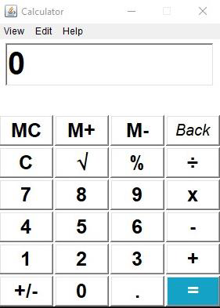

**Java AWT Calculator** 

**Overview** 

This documentation provides an overview of the Calculator application developed using  Java  AWT  components  and  event  handling.  The  calculator  offers  basic arithmetic  operations,  percentage  calculation,  square  root  computation,  memory functions, and additional features like mode switching, and text operations (copy, paste, cut). It also includes help and about sections. 

**Graphical User Interface (GUI)** 

 

Light Mode  Dark Mode 

**Menu Bar Items** 

 

View  Edit 

Help 

**Features** 

Basic Arithmetic Operations 

- Addition (+): Adds two numbers. 
- Subtraction (-): Subtracts the second number from the first number. 
- Multiplication (x): Multiplies two numbers. 
- Division (÷): Divides the first number by the second number.

Additional Operations 

- Percentage (%): Calculates the percentage of a number. 
- Square Root (√): Calculates the square root of a number. 
- Change Sign (+/-): Changes the sign of the number displayed. 
- Clear (C): Clears the current input.

Memory Operations 

- Memory Clear (MC): Clears the memory. 
- Memory Add (M+): Adds the current input to the memory. 
- Memory Subtract (M-): Subtracts the current input from the memory.

User Interface Options 

- Light Mode: Switches the calculator to a light colour scheme. 
- Dark Mode: Switches the calculator to a dark colour scheme. 
- Copy: Copies the current input to the clipboard. 
- Paste: Pastes the content from the clipboard to the input field. 
- Cut: Cuts the current input and copies it to the clipboard. 
- Backspace (Back): Deletes the last character in the input field.

Help and About 

- About: Provides information about the developer and the application. 
- Help: Provides instructions on how to use the calculator.

**Technologies Used** 

Java AWT 

- The  application  is  built  using  the  Abstract  Window  Toolkit  (AWT),  which provides a set of APIs for creating graphical user interfaces in Java. 

**Event Handling** 

- Event  handling  in  the  application  is  implemented  using  ActionListener  to manage user interactions with buttons and menu items. 

**Clipboard Operations** 

- Clipboard  operations  (copy,  paste,  cut)  are  handled  using  the **java.awt.datatransfer** package**.** 

**Frame and Panel** 

The user interface is constructed using Frames and Panels: 

- Frame: The main window and additional windows for "About" and "Help". 
- Panel: Used for organizing the layout of buttons and the text field. 

**Buttons** 

The calculator has the following buttons for user interaction: 

- Numeric buttons: 0-9 
- Arithmetic operation buttons: +, -, x, ÷ 
- Additional operation buttons: %, √, +/-, C, Back, . 
- Memory operation buttons: MC, M+, M- 
- Equals button: = 

Java  AWT Code 

class Cal implements ActionListener {     TextField tf; 

`    `Button btn0, btn1, btn2, btn3, btn4, btn5, btn6, btn7, btn8, btn9, btnA, btnS, 

`            `btnM, btnD, btnP, btnSq, btnC, btnAm, btnDo, btnEq, btnMC, btnMm,        btnMP, btnB; 

Cal() { 

`        `f = new Frame(); 

`        `f.addWindowListener(new Close());         f.setBackground(Color.white); 

`        `f.setTitle("Calculator"); 

`        `f.setResizable(false); 

`        `f.setSize(300, 400); 

`        `f.setLocationRelativeTo(null); 

Font f1 = new Font("Constantia", Font.BOLD, 25); 

`        `Font fb = new Font("Constantia",  Font.HANGING\_BASELINE, 20); 

Font f2 = new Font("Georgia", Font.BOLD, 30); Font f3 = new Font("Rockwell", Font.BOLD, 40); 

Panel p1 = new Panel(); 

Panel p2 = new Panel(); 

GridLayout g1 = new GridLayout(6, 4, 2, 2); p2.setLayout(g1); 

p2.setBackground(Color.white); 

`        `tf = new TextField(11); 

`        `tf.setFont(f3); 

`        `tf.setEditable(true); 

`      `tf.setForeground(Color.black);      tf.setBackground(Color.white);         tf.setText("0"); 

`        `p1.add(tf); 

`   `p1.setBackground(Color.white);         btn0 = new Button("0"); 

`        `btn1 = new Button("1"); 

`        `btn2 = new Button("2"); 

btn3 = new Button("3"); btn4 = new Button("4"); btn5 = new Button("5"); btn6 = new Button("6"); btn7 = new Button("7"); btn8 = new Button("8"); btn9 = new Button("9"); btnA = new Button("+"); btnS = new Button("-"); btnM = new Button("x"); 

`        `btnAm = new Button("+/-");  btnEq.setForeground(Color.white); 

`        `btnDo = new Button(".");         btnMC.setBackground(Color.white); 

`        `btnEq = new Button("=");         btnMm.setBackground(Color.white);         btnD = new Button("÷");       btnMP.setFont(f1); 

`        `btnP = new Button("%");         btnB.setFont(fb); 

`        `btnSq = new Button("√");         p2.add(btnMC); 

`        `btnC = new Button("C");         p2.add(btnMP); 

`       `btnMC = new Button("MC");         p2.add(btnMm); 

`        `btnMm = new Button("M-"); 

`        `p2.add(btnB); 

`        `btnMP = new Button("M+"); 

`        `p2.add(btnC); 

`        `btnB = new Button("Back"); 

`        `p2.add(btnSq); 

`        `btn0.setBackground(Color.white); 

`        `p2.add(btnP); 

`        `btn1.setBackground(Color.white); 

`        `p2.add(btnD); 

`        `btn2.setBackground(Color.white); 

`        `p2.add(btn7); 

`        `btn3.setBackground(Color.white); 

`        `btn4.setBackground(Color.white);         p2.add(btn8); 

`        `btn5.setBackground(Color.white);         p2.add(btn9); 

`        `btn6.setBackground(Color.white);         p2.add(btnM); 

`        `btn7.setBackground(Color.white);         p2.add(btn4); 

`        `btn8.setBackground(Color.white);         p2.add(btn5); 

`        `btn9.setBackground(Color.white);         p2.add(btn6); 

`        `btnA.setBackground(Color.white);         p2.add(btnS); 

`        `btnS.setBackground(Color.white);         p2.add(btn1); 

`        `btnM.setBackground(Color.white);         p2.add(btn2); 

`        `btnD.setBackground(Color.white);         p2.add(btn3); 

`        `btnP.setBackground(Color.white);         p2.add(btnA); 

`        `btnSq.setBackground(Color.white);         p2.add(btnAm); 

`        `btnC.setBackground(Color.white); 

`        `p2.add(btn0); 

`        `btnAm.setBackground(Color.white); 

`        `p2.add(btnDo); btnDo.setBackground(Color.white); 

`        `p2.add(btnEq); btnEq.setBackground(Color.decode("#14A3C7")); 

`        `btn0.addActionListener(this); 

`        `btn1.addActionListener(this); 

btn2.addActionListener(this); btn3.addActionListener(this); btn4.addActionListener(this); 

btn5.addActionListener(this); btn6.addActionListener(this); btn7.addActionListener(this); btn8.addActionListener(this); 

btn9.addActionListener(this);  btnA.addActionListener(this);  btnS.addActionListener(this);  btnM.addActionListener(this);  btnD.addActionListener(this);  btnP.addActionListener(this);  btnSq.addActionListener(this);  btnC.addActionListener(this);  btnAm.addActionListener(this);  btnDo.addActionListener(this);  btnEq.addActionListener(this);  btnMC.addActionListener(this);  btnMm.addActionListener(this);  btnMP.addActionListener(this);  btnB.addActionListener(this); 

f.add(p1, BorderLayout.NORTH); f.add(p2, BorderLayout.SOUTH); 

`        `f.setVisible(true);   } 

Basic Arithmetic Operations 

- Addition (+): Adds two numbers. 
- Subtraction (-): Subtracts the second number from the first number. 
- Multiplication (x): Multiplies two numbers. 
- Division (÷): Divides the first number by the second number.

public void actionPerformed(ActionEvent d) { 

`        `Object o = d.getSource(); 

`        `String command = d.getActionCommand(); 

`        `if (tf.getText().equals("0") && !o.equals(btnDo)) { 

`            `tf.setText(""); 

`        `} 

`        `if (o.equals(btn0)) { 

`            `tf.setText(tf.getText() + btn0.getLabel());         } else if (o.equals(btn1)) { 

`            `tf.setText(tf.getText() + btn1.getLabel());         } else if (o.equals(btn2)) { 

`            `tf.setText(tf.getText() + btn2.getLabel());         } else if (o.equals(btn3)) { 

`            `tf.setText(tf.getText() + btn3.getLabel());         } else if (o.equals(btn4)) { 

`            `tf.setText(tf.getText() + btn4.getLabel()); 

`        `} else if (o.equals(btn5)) { 

`            `tf.setText(tf.getText() + btn5.getLabel());         } else if (o.equals(btn6)) { 

`            `tf.setText(tf.getText() + btn6.getLabel());         } else if (o.equals(btn7)) { 

`            `tf.setText(tf.getText() + btn7.getLabel());         } else if (o.equals(btn8)) { 

`            `tf.setText(tf.getText() + btn8.getLabel());         } else if (o.equals(btn9)) { 

`            `tf.setText(tf.getText() + btn9.getLabel()); 

  } else if (o.equals(btnA)) { 

`            `fv = tf.getText(); 

`            `op = btnA.getLabel(); 

`            `tf.setText(""); 

`        `} else if (o.equals(btnS)) { 

`            `fv = tf.getText(); 

`            `op = btnS.getLabel(); 

`            `tf.setText(""); 

`        `} else if (o.equals(btnM)) { 

`            `fv = tf.getText(); 

`            `op = btnM.getLabel(); 

`            `tf.setText(""); 

`        `} else if (o.equals(btnD)) { 

`            `fv = tf.getText(); 

`            `op = btnD.getLabel(); 

`            `tf.setText(""); 

`        `} else if (o.equals(btnDo)) { 

`            `if (!tf.getText().contains(".")) { 

`                `tf.setText(tf.getText() + btnDo.getLabel()); 

`            `} 

`        `} else if (o.equals(btnEq)) { 

`            `sv = tf.getText(); 

`            `fdv = Double.parseDouble(fv);             sdv = Double.parseDouble(sv); 

switch (op) { 

`                `case "+": 

`                    `tot = fdv + sdv;                     break; 

`                `case "-": 

`                    `tot = fdv - sdv;                     break; 

`                 `case "x": 

`                     `tot = fdv \* sdv; 

break; 

`                 `case "÷": 

`                     `tot = fdv / sdv;                      break; 

`            `} 

tf.setText(tot.toString());                 

Additional Operations 

- Percentage (%): Calculates the percentage of a number. 
- Square Root (√): Calculates the square root of a number. 
- Change Sign (+/-): Changes the sign of the number displayed. 
- Clear (C): Clears the current input.

`   `} else if (o.equals(btnP)) { 

`            `fdv = Double.parseDouble(tf.getText());             tf.setText((fdv / 100) + ""); 

`        `} else if (o.equals(btnSq)) { 

`            `fdv = Double.parseDouble(tf.getText());             tf.setText(Math.sqrt(fdv) + ""); 

`        `} else if (o.equals(btnC)) { 

`            `tf.setText("0"); 

`            `fv = sv = op = ""; 

`        `} else if (o.equals(btnAm)) { 

`            `fdv = Double.parseDouble(tf.getText());             tf.setText((-fdv) + "");  

else if (o.equals(btnB)) { 

`            `String text = tf.getText();             if (text.length() > 0) { 

`                `tf.setText(text.substring(0, text.length() - 1)); 

`            `} 

`            `if (tf.getText().isEmpty()) {                 tf.setText("0"); 

`            `}  

Memory Operations 

- Memory Clear (MC): Clears the memory. 
- Memory Add (M+): Adds the current input to the memory. 
- Memory Subtract (M-): Subtracts the current input from the memory.

} else if (o.equals(btnMC)) { 

`            `memory = 0.0; 

`        `} else if (o.equals(btnMm)) { 

`            `memory -= Double.parseDouble(tf.getText());         } else if (o.equals(btnMP)) { 

`            `memory += Double.parseDouble(tf.getText())  

User Interface Options 

- Light Mode: Switches the calculator to a light colour scheme. 
- Dark Mode: Switches the calculator to a dark colour scheme. 
- Copy: Copies the current input to the clipboard. 
- Paste: Pastes the content from the clipboard to the input field. 
- Cut: Cuts the current input and copies it to the clipboard. 
- Backspace (Back): Deletes the last character in the input field.

Help and About 

- About: Provides information about the developer and the application. 
- Help: Provides instructions on how to use the calculator

`     `MenuBar mb = new MenuBar(); 

`        `Menu menu1 = new Menu("View"); 

`        `MenuItem ml = new MenuItem("Light Mode"); 

`        `MenuItem md = new MenuItem("Dark Mode"); 

ml.addActionListener(this); md.addActionListener(this); menu1.add(ml); 

menu1.add(md); 

Menu menu2 = new Menu("Edit"); MenuItem m1 = new MenuItem("Copy"); MenuItem m2 = new MenuItem("Paste"); MenuItem m5 = new MenuItem("Cut"); 

m1.addActionListener(this); m2.addActionListener(this); m5.addActionListener(this); 

menu2.add(m1); 

menu2.add(m2); 

menu2.add(m5); 

Menu menu3 = new Menu("Help"); MenuItem m3 = new MenuItem("About"); 

MenuItem m4 = new MenuItem("Help"); m3.addActionListener(this); m4.addActionListener(this); menu3.add(m3); 

menu3.add(m4); 

mb.add(menu1); mb.add(menu2); mb.add(menu3); f.setMenuBar(mb); 

  } else if (command.equals("Light Mode")) { 

`            `setLightMode(); 

`        `} else if (command.equals("Dark Mode")) {             setDarkMode(); 

`        `} else if (command.equals("Copy")) { 

`            `copyText(); 

`        `} else if (command.equals("Paste")) { 

`            `pasteText(); 

`        `} else if (command.equals("Cut")) { 

`            `cutText(); 

`        `} else if (command.equals("About")) { 

`            `showAbout(); 

`        `} else if (command.equals("Help")) { 

`            `showHelp(); 

`        `} 

`    `} 

**Light Mode** 

`    `} 

private void setLightMode() { ![ref1]

`        `darkMode = false; 

`        `f.setBackground(Color.white); 

`        `tf.setBackground(Color.white); 

`        `tf.setForeground(Color.black); 

`        `tf.setText("0"); 

`        `btn0.setBackground(Color.white); 

`        `btn1.setBackground(Color.white); 

`        `btn2.setBackground(Color.white); 

`        `btn3.setBackground(Color.white); 

`        `btn4.setBackground(Color.white); 

`        `btn5.setBackground(Color.white); 

`        `btn6.setBackground(Color.white); 

`        `btn7.setBackground(Color.white); 

`        `btn8.setBackground(Color.white); 

`        `btn9.setBackground(Color.white); 

`        `btnA.setBackground(Color.white); 

`        `btnS.setBackground(Color.white); 

`        `btnM.setBackground(Color.white);         btnD.setBackground(Color.white); 

`        `btnP.setBackground(Color.white); 

`        `btnSq.setBackground(Color.white);         btnC.setBackground(Color.white); 

`        `btnAm.setBackground(Color.white);         btnDo.setBackground(Color.white); 

btnEq.setBackground(Color.decode("#14A3C7")) ; 

`        `btnEq.setForeground(Color.white);         btnMC.setBackground(Color.white);       btnMm.setBackground(Color.white); 

btnMP.setBackground(Color.white); 

`        `btnB.setBackground(Color.white); ![ref2]

` `btn0.setForeground(Color.black); 

`        `btn1.setForeground(Color.black); 

`        `btn2.setForeground(Color.black); 

`        `btn3.setForeground(Color.black); 

`        `btn4.setForeground(Color.black); 

`        `btn5.setForeground(Color.black); 

`        `btn6.setForeground(Color.black); 

`        `btn7.setForeground(Color.black); 

`        `btn8.setForeground(Color.black); 

`        `btn9.setForeground(Color.black); 

`        `btnA.setForeground(Color.black); 

`        `btnS.setForeground(Color.black); 

`        `btnM.setForeground(Color.black); 

`        `btnD.setForeground(Color.black); 

`        `btnP.setForeground(Color.black); 

`        `btnSq.setForeground(Color.black); 

`        `btnC.setForeground(Color.black); 

`        `btnAm.setForeground(Color.black); 

`        `btnDo.setForeground(Color.black); 

`        `btnEq.setForeground(Color.white); 

`        `btnMC.setForeground(Color.black); 

`        `btnMm.setForeground(Color.black); 

`        `btnMP.setForeground(Color.black); 

`        `btnB.setForeground(Color.black); 

`        `for (Component comp : f.getComponents()) {             comp.setBackground(Color.white); 

`            `comp.setForeground(Color.black); 

`        `} 

`    `} 

**Dark Mode** 

`    `} 

private void setDarkMode() { ![ref1]

`        `darkMode = true; 

`        `f.setBackground(Color.darkGray); 

`        `tf.setBackground(Color.darkGray); 

`        `tf.setForeground(Color.white); 

`        `tf.setText("0"); 

`        `btn0.setBackground(Color.darkGray);         btn1.setBackground(Color.darkGray);         btn2.setBackground(Color.darkGray);         btn3.setBackground(Color.darkGray);         btn4.setBackground(Color.darkGray); 

btn5.setBackground(Color.darkGray); btn6.setBackground(Color.darkGray); btn7.setBackground(Color.darkGray); btn8.setBackground(Color.darkGray); btn9.setBackground(Color.darkGray); btnA.setBackground(Color.darkGray); btnS.setBackground(Color.darkGray); btnM.setBackground(Color.darkGray); btnD.setBackground(Color.darkGray); btnP.setBackground(Color.darkGray); btnSq.setBackground(Color.darkGray); btnC.setBackground(Color.darkGray); btnAm.setBackground(Color.darkGray); btnDo.setBackground(Color.darkGray); 

btnEq.setBackground(Color.decode("#00827F"));         btnMC.setBackground(Color.darkGray); 

`        `btnMm.setBackground(Color.darkGray); 

btnMP.setBackground(Color.darkGray); 

`        `btnB.setBackground(Color.darkGray); ![ref2]

`        `btn0.setForeground(Color.white); 

`        `btn1.setForeground(Color.white); 

`        `btn2.setForeground(Color.white); 

`        `btn3.setForeground(Color.white); 

`        `btn4.setForeground(Color.white); 

`        `btn5.setForeground(Color.white); 

`        `btn6.setForeground(Color.white); 

`        `btn7.setForeground(Color.white); 

`        `btn8.setForeground(Color.white); 

`        `btn9.setForeground(Color.white); 

`        `btnA.setForeground(Color.white); 

`        `btnS.setForeground(Color.white); 

`        `btnM.setForeground(Color.white); 

`        `btnD.setForeground(Color.white); 

`        `btnP.setForeground(Color.white); 

`        `btnSq.setForeground(Color.white); 

`        `btnC.setForeground(Color.white); 

`        `btnAm.setForeground(Color.white); 

`        `btnDo.setForeground(Color.white); 

`        `btnEq.setForeground(Color.white); 

`        `btnMC.setForeground(Color.white); 

`        `btnMm.setForeground(Color.white); 

`        `btnMP.setForeground(Color.white); 

`        `btnB.setForeground(Color.white); 

`        `for (Component comp : f.getComponents()) {             comp.setBackground(Color.darkGray); 

`            `comp.setForeground(Color.white); 

`        `} 

`    `} 

**Copy** 

private void copyText() { 

`        `String text = tf.getText(); 

`        `StringSelection stringSelection = new StringSelection(text); 

`        `Clipboard clipboard = Toolkit.getDefaultToolkit().getSystemClipboard();         clipboard.setContents(stringSelection, null); 

`    `} 

**Paste** 

private void pasteText() { 

`        `try { 

`            `Clipboard clipboard = Toolkit.getDefaultToolkit().getSystemClipboard(); 

`            `Transferable contents = clipboard.getContents(null); 

`            `if (contents != null && contents.isDataFlavorSupported(DataFlavor.stringFlavor)) {                 String text = (String) contents.getTransferData(DataFlavor.stringFlavor); 

`                `tf.setText(text);             } 

`        `} catch (Exception e) {             e.printStackTrace();         } 

**Cut** 

private void cutText() { 

`        `String text = tf.getText(); 

`        `StringSelection stringSelection = new StringSelection(text); 

`        `Clipboard clipboard = Toolkit.getDefaultToolkit().getSystemClipboard();         clipboard.setContents(stringSelection, null); 

`        `tf.setText(""); 

`    `} 

**About** 

`  `private void showAbout() { 

`        `if (af == null) { 

`            `af = new Frame("About");             af.setSize(300, 200); 

`            `af.setResizable(false); 

`            `af.setFont(f4); 

`            `tf.setText("0"); 

af.setLayout(new FlowLayout()); 

`            `af.add(new Label("Developed by W.D. Ishara Sahan Kaushalya")); 

af.add(new Label("NIC :- 200324412712  \n")); af.add(new Label("NARWHAL GAMPAHA")); 

`            `af.add(new Label("SAD Assignment 01 ( Java  AWT  )")); 

`            `af.add(new Label("Calculator v1.1.2")); 

`            `af.addWindowListener(new WindowAdapter() {                 public void windowClosing(WindowEvent e) {                     af.dispose(); 

`                    `af = null; 

`                `} 

`            `}); 

`        `} 

`        `af.setLocation(f.getX() + f.getWidth() + 10, f.getY()); 

`        `af.setVisible(true);     } 

**Help** 

`   `private void showHelp() { 

`        `if (hF == null) { 

`            `hF = new Frame("Help");             hF.setSize(300, 200); 

`            `hF.setResizable(false); 

`            `hF.setFont(f4); 

`            `tf.setText("0"); 

hF.setLayout(new FlowLayout()); 

`            `hF.add(new Label("Use the buttons to perform calculations.")); 

`            `hF.add(new Label("Use MC, M+, M- for memory operations.")); 

`            `hF.add(new Label("Use the C button to clear the data.")); 

`            `hF.add(new Label("If you have any problem please contact me.")); 

`            `hF.add(new Label("Email :- sahankaushalya03@gmail.com")); 

`            `hF.addWindowListener(new WindowAdapter() { 

`           `public void windowClosing(WindowEvent e) {  hF.dispose(); 

`  `hF = null;                 }             }); 

`        `} 

`        `hF.setLocation(f.getX() + f.getWidth() + 10, f.getY()); 

`        `hF.setVisible(true);     } 

} 

**Usage Instructions** 

Performing Calculations 

- Enter the first number using the numeric buttons. 
- Select an arithmetic operation (+, -, x, ÷). 
- Enter the second number. 
- Press the "=" button to display the result. 

Using Additional Operations 

- Percentage: Enter a number and press the "%" button. 
- Square Root: Enter a number and press the "√" button. 
- Change Sign: Enter a number and press the "+/-" button. 
- Clear: Press the "C" button to reset the input field. 

Memory Operations 

- Memory Clear: Press the "MC" button to clear the memory. 
- Memory Add: Enter a number and press the "M+" button to add it to memory. 
- Memory Subtract: Enter a number and press the "M-" button to subtract it from memory. 

Mode Switching 

- To switch to Light Mode, select "Light Mode" from the "View" menu. 
- To switch to Dark Mode, select "Dark Mode" from the "View" menu. 

Text Operations 

- To copy the current input, select "Copy" from the "Edit" menu. 
- To paste text into the input field, select "Paste" from the "Edit" menu. 
- To cut the current input, select "Cut" from the "Edit" menu. 

Help and About 

- To view information about the application, select "About" from the "Help" menu. 
- To view instructions on using the calculator, select "Help" from the "Help" menu. 

[ref1]: Aspose.Words.ae395b3a-718c-4ced-9c48-3ba5ec1f5fb6.022.png
[ref2]: Aspose.Words.ae395b3a-718c-4ced-9c48-3ba5ec1f5fb6.023.png
